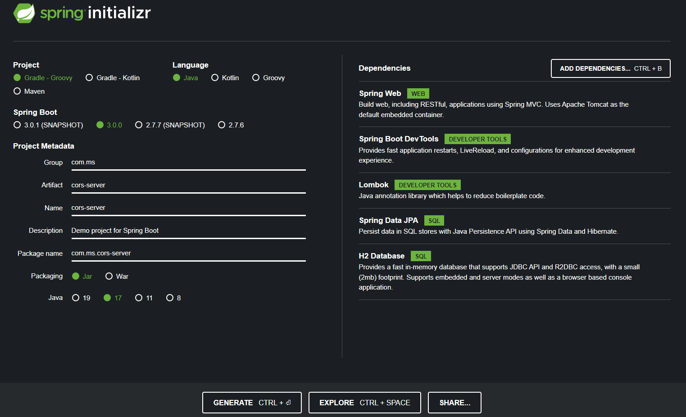
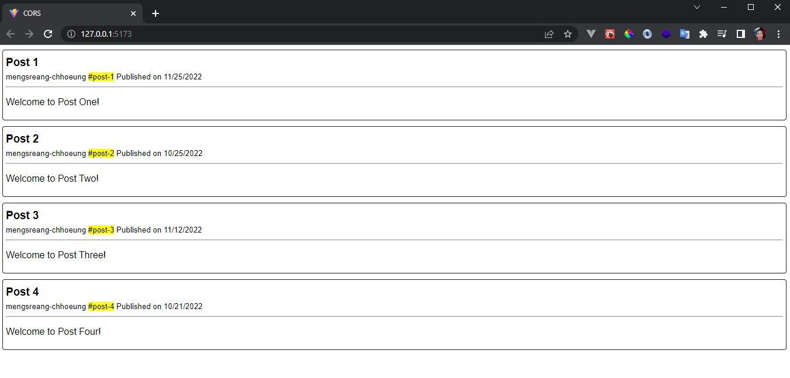

# JPA Security

### Step-by-step example:

- Spring Starter IO:

  

- Go to cors-server/src/main/resources and replace configuration file from `application.properties` to `application.yml`
  .
- Add some configuration to `application.yml`:

  ```yaml
  spring:
    h2:
      console:
        enabled: true
    datasource:
      driver-class-name: org.h2.Driver
      url: jdbc:h2:mem:blogdb
      name: sa
      password: 123456

    jpa:
      show-sql: true
      database-platform: org.hibernate.dialect.H2Dialect
  ```

- Go to cors-server/src/main/java/com/ms/corsserver and create a packages name as model, repository, service, controller, config:

---

- PostEntity.java

  ```java
  package com.ms.corsserver.model.entity;

  import jakarta.persistence.*;
  import lombok.AllArgsConstructor;
  import lombok.Getter;
  import lombok.NoArgsConstructor;
  import lombok.Setter;
  import org.hibernate.Hibernate;

  import java.time.LocalDateTime;
  import java.util.Objects;

  @Entity
  @Table(name = "posts")
  @NoArgsConstructor
  @AllArgsConstructor
  @Setter
  @Getter
  public class PostEntity {
      @Id
      @GeneratedValue(strategy = GenerationType.IDENTITY)
      private Long id;
      private String title;
      private String slug;
      private String content;
      private String author;
      private LocalDateTime publishedOn;

      @Override
      public boolean equals(Object o) {
          if (this == o) return true;
          if (o == null || Hibernate.getClass(this) != Hibernate.getClass(o)) return false;
          PostEntity that = (PostEntity) o;
          return id != null && Objects.equals(id, that.id);
      }

      @Override
      public int hashCode() {
          return getClass().hashCode();
      }

      @Override
      public String toString() {
          return getClass().getSimpleName() + "(" + "id = " + id + ", " + "title = " + title + ", " + "slug = " + slug + ", " + "content = " + content + ", " + "author = " + author + ", " + "publishedOn = " + publishedOn + ")";
      }
  }
  ```

- PostRequest.java

  ```java
  package com.ms.corsserver.model.request.post;

  import com.ms.corsserver.model.entity.PostEntity;
  import lombok.AllArgsConstructor;

  import java.io.Serializable;
  import java.time.LocalDateTime;

  @AllArgsConstructor
  public class PostRequest implements Serializable {
      public String title;
      public String slug;
      public String content;
      public String author;
      public LocalDateTime publishedOn;

      public PostEntity toEntity() {
          PostEntity post = new PostEntity();
          post.setTitle(this.title);
          post.setSlug(this.slug);
          post.setContent(this.content);
          post.setAuthor(this.author);
          post.setPublishedOn(this.publishedOn);

          return post;
      }
  }
  ```

- PostResponse.java

  ```java
  package com.ms.corsserver.model.response.post;

  import com.ms.corsserver.model.entity.PostEntity;
  import lombok.AllArgsConstructor;

  import java.io.Serializable;
  import java.time.ZoneId;

  @AllArgsConstructor
  public class PostResponse implements Serializable {
      public Long id;
      public String title;
      public String slug;
      public String content;
      public String author;
      public Long publishedOn;

      public static PostResponse fromEntity(PostEntity entity) {
          return new PostResponse(entity.getId(), entity.getTitle(), entity.getSlug(), entity.getContent(), entity.getAuthor(), entity.getPublishedOn().atZone(ZoneId.systemDefault()).toInstant().toEpochMilli());
      }
  }
  ```

- PostRepository.java

  ```java
  package com.ms.corsserver.repository;

  import com.ms.corsserver.model.entity.PostEntity;
  import org.springframework.data.jpa.repository.JpaRepository;
  import org.springframework.stereotype.Repository;

  @Repository
  public interface PostRepository extends JpaRepository<PostEntity, Long> {
  }
  ```

- PostService.java

  ```java
  package com.ms.corsserver.service;

  import com.ms.corsserver.model.entity.PostEntity;
  import com.ms.corsserver.repository.PostRepository;
  import org.springframework.beans.factory.annotation.Autowired;
  import org.springframework.stereotype.Service;

  import java.util.List;

  @Service
  public class PostService {
      private final PostRepository postRepository;

      @Autowired
      public PostService(PostRepository _postRepository) {
          this.postRepository = _postRepository;
      }

      public List<PostEntity> findAll() {
          return postRepository.findAll();
      }
  }
  ```

- PostController.java

  ```java
  package com.ms.corsserver.controller;

  import com.ms.corsserver.model.response.post.PostResponse;
  import com.ms.corsserver.service.PostService;
  import org.springframework.beans.factory.annotation.Autowired;
  import org.springframework.http.HttpStatus;
  import org.springframework.http.ResponseEntity;
  import org.springframework.web.bind.annotation.GetMapping;
  import org.springframework.web.bind.annotation.RequestMapping;
  import org.springframework.web.bind.annotation.RestController;

  import java.util.List;

  @RestController
  @RequestMapping("/api/post")
  public class PostController {
      private final PostService postService;

      @Autowired
      public PostController(PostService _poPostService) {
          this.postService = _poPostService;
      }

      @GetMapping
      public ResponseEntity<List<PostResponse>> findAll() {
          List<PostResponse> data = postService.findAll().stream().map(PostResponse::fromEntity).toList();

          return ResponseEntity.status(HttpStatus.OK).body(data);
      }
  }
  ```

- WebMVCConfig.java

  ```java
  package com.ms.corsserver.config;

  import org.springframework.context.annotation.Configuration;
  import org.springframework.web.servlet.config.annotation.CorsRegistry;
  import org.springframework.web.servlet.config.annotation.EnableWebMvc;
  import org.springframework.web.servlet.config.annotation.WebMvcConfigurer;

  @Configuration
  @EnableWebMvc
  public class WebMVCConfig implements WebMvcConfigurer {
      @Override
      public void addCorsMappings(CorsRegistry registry) {
          registry.addMapping("/api/**").allowedOrigins("http://127.0.0.1:5173") // if you want to allow all just put "*"
                  .allowedMethods("GET");
      }
  }
  ```

- CorsServerApplication.java

  ```java
  package com.ms.corsserver;

  import com.ms.corsserver.model.request.post.PostRequest;
  import com.ms.corsserver.repository.PostRepository;
  import org.springframework.boot.CommandLineRunner;
  import org.springframework.boot.SpringApplication;
  import org.springframework.boot.autoconfigure.SpringBootApplication;
  import org.springframework.context.annotation.Bean;

  import java.time.LocalDateTime;

  @SpringBootApplication
  public class CorsServerApplication {

      public static void main(String[] args) {
          SpringApplication.run(CorsServerApplication.class, args);
      }

      @Bean
      CommandLineRunner commandLineRunner(PostRepository postRepository) {
          return args -> {
              PostRequest post1 = new PostRequest("Post 1", "post-1", "Welcome to Post One!", "mengsreang-chhoeung", LocalDateTime.of(2022, 11, 25, 20, 20));
              PostRequest post2 = new PostRequest("Post 2", "post-2", "Welcome to Post Two!", "mengsreang-chhoeung", LocalDateTime.of(2022, 10, 25, 20, 20));
              PostRequest post3 = new PostRequest("Post 3", "post-3", "Welcome to Post Three!", "mengsreang-chhoeung", LocalDateTime.of(2022, 11, 12, 20, 20));
              PostRequest post4 = new PostRequest("Post 4", "post-4", "Welcome to Post Four!", "mengsreang-chhoeung", LocalDateTime.of(2022, 10, 21, 20, 20));
              postRepository.save(post1.toEntity());
              postRepository.save(post2.toEntity());
              postRepository.save(post3.toEntity());
              postRepository.save(post4.toEntity());
          };
      }

  }
  ```

- Go to cors-client/src and update main.tsx

  ```tsx
  import React from "react";
  import ReactDOM from "react-dom/client";
  import App from "./App";

  ReactDOM.createRoot(document.getElementById("root") as HTMLElement).render(
    <React.StrictMode>
      <App />
    </React.StrictMode>
  );
  ```

- Go to cors-client/src and update App.tsx

  ```tsx
  import { useCallback, useEffect, useState } from "react";

  interface Post {
    id: number;
    title: string;
    slug: string;
    content: string;
    author: string;
    publishedOn: number;
  }

  function App() {
    const [post, setPost] = useState<Post[]>([]);

    const fetchPost = useCallback(async () => {
      const data = await fetch(`http://localhost:8080/api/post`);
      data.json().then((res) => {
        setPost(res);
      });
    }, []);

    useEffect(() => {
      fetchPost();
    }, []);

    return (
      <div style={{ fontFamily: "sans-serif" }}>
        {post.length > 0 ? (
          post.map((it) => (
            <div
              key={it.id}
              style={{
                border: "1px solid #222",
                borderRadius: "4px",
                marginBottom: "10px",
                padding: "5px",
              }}
            >
              <h3 style={{ marginTop: "5px", marginBottom: "4px" }}>
                {it.title}
              </h3>
              <small>
                {it.author} <mark>#{it.slug}</mark>{" "}
                <span>
                  Published on {new Date(it.publishedOn).toLocaleDateString()}
                </span>
              </small>
              <hr />
              <p>{it.content}</p>
            </div>
          ))
        ) : (
          <p>No Data</p>
        )}
      </div>
    );
  }

  export default App;
  ```

- Result:

  

  ### Contributors💅

- Mengsreang-Chhoeung <chhoeungmengsreang789@gmail.com>
