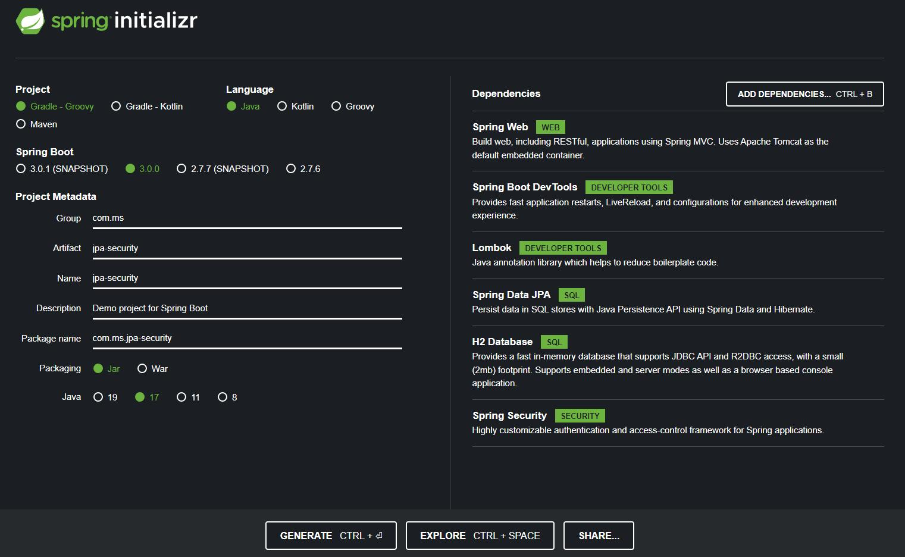

# JPA Security

### Step-by-step example:

- Spring Starter IO:

  

- Go to src/main/resources and replace configuration file from `application.properties` to `application.yml`.
- Add some configuration to `application.yml`:

    ```yml
    spring:
      h2:
        console:
          enabled: true
      datasource:
        driver-class-name: org.h2.Driver
        url: jdbc:h2:mem:blogdb
        name: sa
        password: 123456
    
      jpa:
        show-sql: true
        database-platform: org.hibernate.dialect.H2Dialect
    ```
- Go to src/main/java/com/ms/jpasecurity and create a packages name as model, repository, service, controller, config:

---

- PostEntity.java

  ```java
  package com.ms.jpasecurity.model.entity;
  
  import jakarta.persistence.*;
  import lombok.*;
  import org.hibernate.Hibernate;
  
  import java.time.LocalDateTime;
  import java.util.Objects;
  
  @Entity
  @Table(name = "posts")
  @NoArgsConstructor
  @AllArgsConstructor
  @Getter
  @Setter
  public class PostEntity {
      @Id
      @GeneratedValue(strategy = GenerationType.IDENTITY)
      private Long id;
      private String title;
      private String slug;
      private String content;
      private String author;
      private LocalDateTime publishedOn;
  
      @Override
      public boolean equals(Object o) {
          if (this == o) return true;
          if (o == null || Hibernate.getClass(this) != Hibernate.getClass(o)) return false;
          PostEntity that = (PostEntity) o;
          return id != null && Objects.equals(id, that.id);
      }
  
      @Override
      public int hashCode() {
          return getClass().hashCode();
      }
  
      @Override
      public String toString() {
          return getClass().getSimpleName() + "(" +
                  "id = " + id + ", " +
                  "title = " + title + ", " +
                  "slug = " + slug + ", " +
                  "content = " + content + ", " +
                  "author = " + author + ", " +
                  "publishedOn = " + publishedOn + ")";
      }
  }
  ```

- PostRequest.java

    ```java
    package com.ms.jpasecurity.model.request.post;
    
    import com.ms.jpasecurity.model.entity.PostEntity;
    import lombok.AllArgsConstructor;
    
    import java.io.Serializable;
    import java.time.LocalDateTime;
    
    @AllArgsConstructor
    public class PostRequest implements Serializable {
        public String title;
        public String slug;
        public String content;
        public String author;
        public LocalDateTime publishedOn;
    
        public PostEntity toEntity() {
            PostEntity post = new PostEntity();
            post.setTitle(this.title);
            post.setSlug(this.slug);
            post.setContent(this.content);
            post.setAuthor(this.author);
            post.setPublishedOn(this.publishedOn);
    
            return post;
        }
    }
    ```

- PostResponse.java

    ```java
    package com.ms.jpasecurity.model.response.post;
    
    import com.ms.jpasecurity.model.entity.PostEntity;
    import lombok.AllArgsConstructor;
    
    import java.io.Serializable;
    import java.time.LocalDateTime;
    
    @AllArgsConstructor
    public class PostResponse implements Serializable {
        public Long id;
        public String title;
        public String slug;
        public String content;
        public String author;
        public LocalDateTime publishedOn;
    
        public static PostResponse fromEntity(PostEntity entity) {
            return new PostResponse(entity.getId(), entity.getTitle(), entity.getSlug(), entity.getContent(), entity.getAuthor(), entity.getPublishedOn());
        }
    }
    ```

- PostRepository.java

    ```java
    package com.ms.jpasecurity.repository;
    
    import com.ms.jpasecurity.model.entity.PostEntity;
    import org.springframework.data.jpa.repository.JpaRepository;
    import org.springframework.stereotype.Repository;
    
    @Repository
    public interface PostRepository extends JpaRepository<PostEntity, Long> {
    }
    ```

- PostService.java

    ```java
    package com.ms.jpasecurity.service;
    
    import com.ms.jpasecurity.model.entity.PostEntity;
    import com.ms.jpasecurity.repository.PostRepository;
    import org.springframework.beans.factory.annotation.Autowired;
    import org.springframework.stereotype.Service;
    
    import java.util.List;
    import java.util.Optional;
    
    @Service
    public class PostService {
        private final PostRepository postRepository;
    
        @Autowired
        public PostService(PostRepository _postRepository) {
            this.postRepository = _postRepository;
        }
    
        public List<PostEntity> findAll() {
            return this.postRepository.findAll();
        }
    
        public Optional<PostEntity> findOne(Long id) {
            return this.postRepository.findById(id);
        }
    }
    ```

- PostController.java

    ```java
    package com.ms.jpasecurity.controller;
    
    import com.ms.jpasecurity.model.entity.PostEntity;
    import com.ms.jpasecurity.model.response.post.PostResponse;
    import com.ms.jpasecurity.service.PostService;
    import org.springframework.beans.factory.annotation.Autowired;
    import org.springframework.http.HttpStatus;
    import org.springframework.http.ResponseEntity;
    import org.springframework.web.bind.annotation.GetMapping;
    import org.springframework.web.bind.annotation.PathVariable;
    import org.springframework.web.bind.annotation.RequestMapping;
    import org.springframework.web.bind.annotation.RestController;
    
    import java.util.List;
    
    @RestController
    @RequestMapping("/api/post")
    public class PostController {
        private final PostService postService;
    
        @Autowired
        public PostController(PostService _postService) {
            this.postService = _postService;
        }
        
        @GetMapping
        public ResponseEntity<List<PostResponse>> findAll() {
            List<PostResponse> data = this.postService.findAll().stream().map(PostResponse::fromEntity).toList();
    
            return ResponseEntity.status(HttpStatus.OK).body(data);
        }
        
        @GetMapping("/{id}")
        public ResponseEntity<PostResponse> findOne(@PathVariable Long id) {
            PostEntity data = this.postService.findOne(id).orElse(new PostEntity());
    
            return ResponseEntity.status(HttpStatus.OK).body(PostResponse.fromEntity(data));
        }
    }
    ```
  
- UserEntity.java

  ```java
  package com.ms.jpasecurity.model.entity;
  
  import jakarta.persistence.Entity;
  import jakarta.persistence.GeneratedValue;
  import jakarta.persistence.Id;
  import jakarta.persistence.Table;
  import lombok.AllArgsConstructor;
  import lombok.Getter;
  import lombok.NoArgsConstructor;
  import lombok.Setter;
  import org.hibernate.Hibernate;
  
  import java.util.Objects;
  
  @Entity
  @Table(name = "users")
  @NoArgsConstructor
  @AllArgsConstructor
  @Getter
  @Setter
  public class UserEntity {
      @Id
      @GeneratedValue
      private Long id;
      private String username;
      private String password;
      private String roles;
  
      @Override
      public boolean equals(Object o) {
          if (this == o) return true;
          if (o == null || Hibernate.getClass(this) != Hibernate.getClass(o)) return false;
          UserEntity that = (UserEntity) o;
          return id != null && Objects.equals(id, that.id);
      }
  
      @Override
      public int hashCode() {
          return getClass().hashCode();
      }
  
      @Override
      public String toString() {
          return getClass().getSimpleName() + "(" +
                  "id = " + id + ", " +
                  "username = " + username + ", " +
                  "password = " + password + ", " +
                  "roles = " + roles + ")";
      }
  }
  ```
  
- UserRequest.java

  ```java
  package com.ms.jpasecurity.model.request.user;
  
  import com.ms.jpasecurity.model.entity.UserEntity;
  import lombok.AllArgsConstructor;
  
  import java.io.Serializable;
  
  @AllArgsConstructor
  public class UserRequest implements Serializable {
      public String username;
      public String password;
      public String roles;
  
      public UserEntity toEntity() {
          UserEntity user = new UserEntity();
          user.setUsername(this.username);
          user.setPassword(this.password);
          user.setRoles(this.roles);
  
          return user;
      }
  }
  ```
  
- UserRepository.java

  ```java
  package com.ms.jpasecurity.repository;
  
  import com.ms.jpasecurity.model.entity.UserEntity;
  import org.springframework.data.jpa.repository.JpaRepository;
  import org.springframework.stereotype.Repository;
  
  import java.util.Optional;
  
  @Repository
  public interface UserRepository extends JpaRepository<UserEntity, Long> {
      Optional<UserEntity> findByUsername(String username);
  }
  ```
  
- UserDetail.java

  ```java
  package com.ms.jpasecurity.model.entity;
  
  import org.springframework.beans.factory.annotation.Autowired;
  import org.springframework.security.core.GrantedAuthority;
  import org.springframework.security.core.authority.SimpleGrantedAuthority;
  import org.springframework.security.core.userdetails.UserDetails;
  
  import java.util.Arrays;
  import java.util.Collection;
  
  public class UserDetail implements UserDetails {
      private final UserEntity user;
  
      @Autowired
      public UserDetail(UserEntity _user) {
          this.user = _user;
      }
  
      @Override
      public String getUsername() {
          return this.user.getUsername();
      }
  
      @Override
      public String getPassword() {
          return this.user.getPassword();
      }
  
      @Override
      public Collection<? extends GrantedAuthority> getAuthorities() {
          return Arrays.stream(this.user.getRoles().split(",")).map(SimpleGrantedAuthority::new).toList();
      }
  
      @Override
      public boolean isAccountNonExpired() {
          return true;
      }
  
      @Override
      public boolean isAccountNonLocked() {
          return true;
      }
  
      @Override
      public boolean isCredentialsNonExpired() {
          return true;
      }
  
      @Override
      public boolean isEnabled() {
          return true;
      }
  }
  ```
  
- UserDetailService.java

  ```java
  package com.ms.jpasecurity.service;
  
  import com.ms.jpasecurity.model.entity.UserDetail;
  import com.ms.jpasecurity.repository.UserRepository;
  import org.springframework.beans.factory.annotation.Autowired;
  import org.springframework.security.core.userdetails.UserDetails;
  import org.springframework.security.core.userdetails.UserDetailsService;
  import org.springframework.security.core.userdetails.UsernameNotFoundException;
  import org.springframework.stereotype.Service;
  
  @Service
  public class UserDetailService implements UserDetailsService {
      private final UserRepository userRepository;
  
      @Autowired
      public UserDetailService(UserRepository _userRepository) {
          this.userRepository = _userRepository;
      }
  
      @Override
      public UserDetails loadUserByUsername(String username) throws UsernameNotFoundException {
          return userRepository.findByUsername(username).map(UserDetail::new).orElseThrow(() -> new UsernameNotFoundException("Username not found: " + username));
      }
  }
  ```
  
- SecurityConfig.java

  ```java
  package com.ms.jpasecurity.config;
  
  import com.ms.jpasecurity.service.UserDetailService;
  import org.springframework.beans.factory.annotation.Autowired;
  import org.springframework.context.annotation.Bean;
  import org.springframework.context.annotation.Configuration;
  import org.springframework.security.config.Customizer;
  import org.springframework.security.config.annotation.method.configuration.EnableMethodSecurity;
  import org.springframework.security.config.annotation.web.builders.HttpSecurity;
  import org.springframework.security.config.annotation.web.configuration.EnableWebSecurity;
  import org.springframework.security.crypto.bcrypt.BCryptPasswordEncoder;
  import org.springframework.security.crypto.password.PasswordEncoder;
  import org.springframework.security.web.SecurityFilterChain;
  
  @Configuration
  @EnableWebSecurity
  @EnableMethodSecurity
  public class SecurityConfig {
      private final UserDetailService userDetailService;
  
      @Autowired
      public SecurityConfig(UserDetailService _userDetailService) {
          this.userDetailService = _userDetailService;
      }
  
      @Bean
      SecurityFilterChain securityFilterChain(HttpSecurity http) throws Exception {
          return http
                  .csrf().disable()
                  .authorizeHttpRequests(auth -> auth
                          .requestMatchers("/api/post").permitAll()
                          .anyRequest().authenticated()
                  )
                  .userDetailsService(userDetailService)
                  .headers(headers -> headers.frameOptions().disable())
                  .httpBasic(Customizer.withDefaults())
                  .build();
      }
  
      @Bean
      PasswordEncoder passwordEncoder() {
          return new BCryptPasswordEncoder();
      }
  }
  ```
  
- Add @PreAuthorize to PostController.java

  ```java
  package com.ms.jpasecurity.controller;
  
  import com.ms.jpasecurity.model.entity.PostEntity;
  import com.ms.jpasecurity.model.response.post.PostResponse;
  import com.ms.jpasecurity.service.PostService;
  import org.springframework.beans.factory.annotation.Autowired;
  import org.springframework.http.HttpStatus;
  import org.springframework.http.ResponseEntity;
  import org.springframework.security.access.prepost.PreAuthorize;
  import org.springframework.web.bind.annotation.GetMapping;
  import org.springframework.web.bind.annotation.PathVariable;
  import org.springframework.web.bind.annotation.RequestMapping;
  import org.springframework.web.bind.annotation.RestController;
  
  import java.util.List;
  
  @RestController
  @RequestMapping("/api/post")
  public class PostController {
      private final PostService postService;
  
      @Autowired
      public PostController(PostService _postService) {
          this.postService = _postService;
      }
  
      @PreAuthorize("hasAnyRole('USER', 'ADMIN')")
      @GetMapping
      public ResponseEntity<List<PostResponse>> findAll() {
          List<PostResponse> data = this.postService.findAll().stream().map(PostResponse::fromEntity).toList();
  
          return ResponseEntity.status(HttpStatus.OK).body(data);
      }
  
      @PreAuthorize("hasRole('USER')")
      @GetMapping("/{id}")
      public ResponseEntity<PostResponse> findOne(@PathVariable Long id) {
          PostEntity data = this.postService.findOne(id).orElse(new PostEntity());
  
          return ResponseEntity.status(HttpStatus.OK).body(PostResponse.fromEntity(data));
      }
  }
  ```
  
- JpaSecurityApplication.java

  ```java
  package com.ms.jpasecurity;
  
  import com.ms.jpasecurity.model.entity.PostEntity;
  import com.ms.jpasecurity.model.request.post.PostRequest;
  import com.ms.jpasecurity.model.request.user.UserRequest;
  import com.ms.jpasecurity.repository.PostRepository;
  import com.ms.jpasecurity.repository.UserRepository;
  import org.springframework.boot.CommandLineRunner;
  import org.springframework.boot.SpringApplication;
  import org.springframework.boot.autoconfigure.SpringBootApplication;
  import org.springframework.context.annotation.Bean;
  import org.springframework.security.crypto.password.PasswordEncoder;
  
  import java.time.LocalDateTime;
  
  @SpringBootApplication
  public class JpaSecurityApplication {
  
      public static void main(String[] args) {
          SpringApplication.run(JpaSecurityApplication.class, args);
      }
  
      @Bean
      CommandLineRunner commandLineRunner(PostRepository postRepository, UserRepository userRepository, PasswordEncoder encoder) {
          return args -> {
              UserRequest user1 = new UserRequest("user", encoder.encode("123456"), "ROLE_USER");
              UserRequest user2 = new UserRequest("admin", encoder.encode("123456"), "ROLE_ADMIN");
              PostRequest post1 = new PostRequest("Post 1", "post-1", "Welcome to Post One!", "mengsreang-chhoeung", LocalDateTime.of(2022, 11, 25, 20, 20));
              PostRequest post2 = new PostRequest("Post 2", "post-2", "Welcome to Post Two!", "mengsreang-chhoeung", LocalDateTime.of(2022, 10, 25, 20, 20));
              userRepository.save(user1.toEntity());
              userRepository.save(user2.toEntity());
              postRepository.save(post1.toEntity());
              postRepository.save(post2.toEntity());
          };
      }
  
  }
  ```